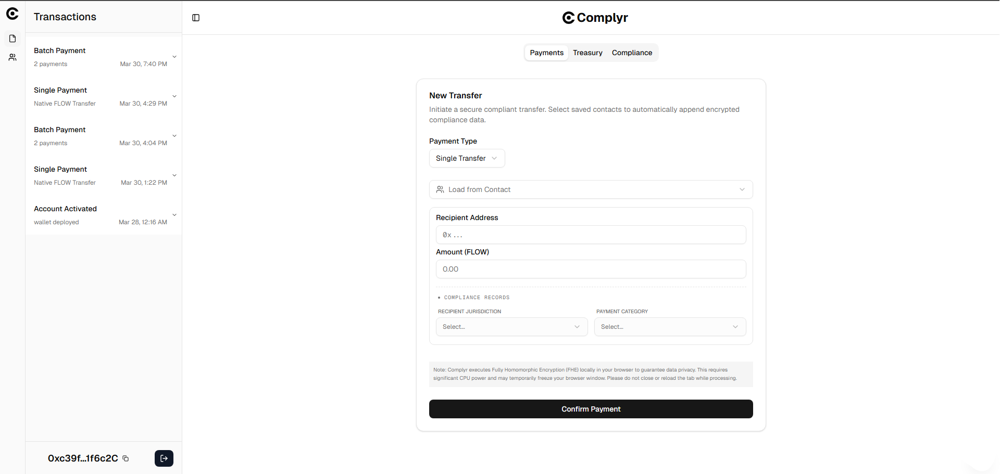
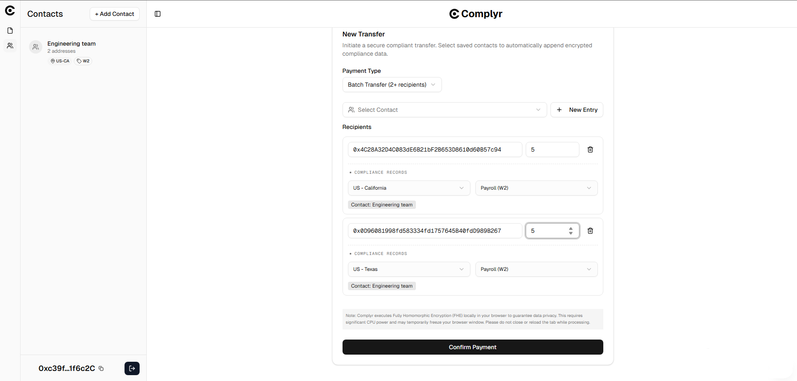
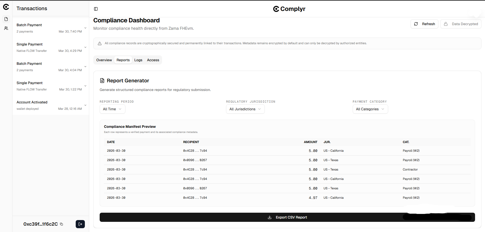
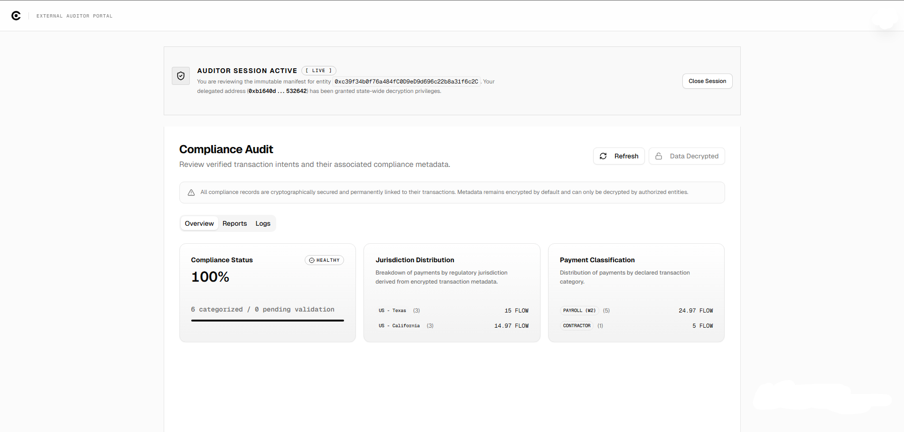

<div align="center">


# Complyr

### Payment infrastructure that attaches encrypted compliance records to onchain transactions.

<br />

[](https://usecomplyr.vercel.app)
[](https://www.youtube.com/watch?v=nA0UUiCnMW0)
[](https://usecomplyr.vercel.app/docs)

<br />


</div>

---

> **For judges and reviewers:** This README covers the highlights. The full product documentation — architecture deep-dive, smart contract reference, FHE encryption flow, auditor portal design, known limitations, and roadmap — is written up at **[usecomplyr.vercel.app/docs](https://usecomplyr.vercel.app/docs)**. Worth a look if you want to understand the full system.

---

## Demo

<div align="center">

[](https://www.youtube.com/watch?v=nA0UUiCnMW0)

*▶ Click to watch the demo*

</div>

---

## The problem

Blockchain payments faithfully record *who* was paid and *how much*. They say nothing about *why*.

In traditional finance, that explanation is not optional. Tax authorities require proof of business purpose. Auditors need traceable documentation. Regulators expect structured records that can be inspected on demand and retained for five to seven years in most jurisdictions. A company that pays a contractor $2,000, a SaaS vendor $500, and a marketing agency $1,000 in the same week needs to document each payment as a legitimate business expense — or risk those deductions being disallowed and the outflows reclassified as personal income.

Blockchain wallets, as they exist today, produce none of this. The payment executes. The compliance layer does not exist.

The conventional responses — off-chain accounting software, manual reconciliation, centralised compliance databases — require trusting a third party with sensitive financial data and maintaining a separate system that must constantly be kept in sync with the blockchain. They reintroduce the fragility and opacity that onchain finance is supposed to eliminate.

**Complyr solves the missing "why."** It attaches an encrypted, immutable compliance record to every payment — capturing expense category and regulatory jurisdiction per recipient — without ever exposing sensitive business context to the public ledger.

---

<div align="center">



*The Complyr wallet dashboard — Payments, Treasury, and Compliance in one view.*

</div>

## How it works

Every Complyr payment produces two permanent, cryptographically linked records:

| | Flow EVM | Zama fhEVM |
|---|---|---|
| **Type** | Public payment ledger | Encrypted compliance ledger |
| **Contents** | Recipients, amounts, timestamps | Expense category + jurisdiction per recipient |
| **Visibility** | Anyone | Company owner + authorised auditors only |

These two ledgers are permanently linked through a deterministic transaction reference derived from the payment intent identifier. Together they answer both "what happened" and "why it happened" — without the second answer ever being visible to the public.

```
User creates payment + attaches compliance metadata (category + jurisdiction per recipient)
          │
          ▼
Metadata encrypted client-side via Zama relayer SDK (WASM, runs in-browser)
          │
          ├─────────────────────────────────────────────────────────────────┐
          ▼                                                                 ▼
  Flow EVM                                                      LayerZero V2 Bridge
  Payment executes via ERC-4337 smart wallet                    Encrypted payload sent cross-chain
  Gasless — sponsored by VerifyingPaymaster                                 │
                                                                            ▼
                                                                  Zama Sepolia (fhEVM)
                                                                  ComplianceReceiver decodes message
                                                                  ComplianceRegistry stores euint8 ciphertext
                                                                  FHE.fromExternal() validates ZK proof on-chain
                                                                  ACL access granted to owner + auditors
```

> On testnet, a relay API path (`/api/relay/compliance-record`) submits compliance records directly to the registry for demo reliability, bypassing LayerZero.

<div align="center">



*Batch payment form — compliance metadata (category + jurisdiction) attached per recipient at payment time.*

</div>

---

## Architecture

Complyr is built across three distinct layers, each with a defined responsibility.

### Layer 1 — Smart contracts on Flow EVM

**`SmartWallet`** is an ERC-4337 compliant smart account, deployed as a minimal proxy clone per business entity via `Clones.cloneDeterministic`. The address is deterministic, enabling counterfactual wallets and gasless `initCode` deployment. The wallet maintains two fund states: *available balance* and *committed balance*. When a recurring payment intent is created, the full expected commitment is locked — preventing those funds from being spent elsewhere until each scheduled cycle executes or the intent is cancelled. All transactions are fully gasless, sponsored through a self-hosted Skandha bundler on Railway (no public bundler supports Flow testnet).

**`SmartWalletFactory`** deploys and tracks smart wallet clones, one per user identity. Uses the owner address as the deterministic salt. Pre-funded to drip `100 FLOW` to each newly deployed wallet, making testnet onboarding frictionless. Designed to trigger automatic company registration on Zama Sepolia at wallet creation via the Compliance Bridge. On testnet, registration is handled through the relay API due to LayerZero DVN instability.

**`IntentRegistry`** is the scheduling and compliance dispatch engine. It manages the full intent lifecycle: creation, recurring execution, and cancellation with automatic fund release. Key design decisions:

- Validates fund availability before locking (`totalAmountPerCycle × totalCycles`)
- Hard limits: max 10 recipients per intent, minimum 30s interval, maximum 365-day duration
- Implements the Chainlink Automation interface (`checkUpkeep` / `performUpkeep`), polled by a custom keeper on Railway every 30 seconds
- In the production design, each execution cycle produces its own compliance record referencing the originating intent. The current testnet implementation sends compliance data once at intent creation as an optimisation
- Skip-on-fail execution: if a recipient transfer fails, the amount is recorded in `intent.failedAmount` for recovery, and execution continues for remaining recipients rather than reverting the whole cycle
- Compliance reports are dispatched to the bridge at intent creation; the bridge self-funds its LayerZero fees from its treasury

**`ComplianceBridge`** is a LayerZero V2 OApp. It encodes compliance payloads and sends them cross-chain to Zama Sepolia. Overrides `_payNative` to pay fees from its own balance, so callers never attach `msg.value`. Supports two message types: `MSG_REGISTER` (company identity, sent at wallet creation) and `MSG_REPORT` (compliance payload, sent at payment execution). LayerZero guarantees delivery — failed messages persist in the queue and can be retried.

**`VerifyingPaymaster`** unconditionally sponsors all user operations on testnet, making the UX fully gasless.

---

### Layer 2 — Encrypted compliance records on Zama Sepolia

**`ComplianceRegistry`** is the core privacy-preserving storage contract on Zama's fhEVM. It maintains an isolated compliance ledger per company, keyed by Flow proxy address. Each record stores:

- `flowTxHash` — deterministic link to the Flow transaction or intent ID
- `recipients[]` and `amounts[]` — plaintext (already public on the payment ledger; encrypting them provides no additional privacy)
- `categories[]` — one `euint8` FHE ciphertext per recipient (expense category)
- `jurisdictions[]` — one `euint8` FHE ciphertext per recipient (regulatory jurisdiction)
- `timestamp` — block timestamp at record creation

FHE values are materialised using `FHE.fromExternal(handle, proof)`, which validates the zero-knowledge proof on-chain before the ciphertext is accepted. No plaintext category or jurisdiction value is ever exposed to the mempool or public state. Access is managed through Zama's native ACL system — granted to the company's master EOA and up to three designated external auditors. Auditors added after records exist receive retroactive decryption access across all historical records via a loop that calls `FHE.allow` on every existing ciphertext.

Fully Homomorphic Encryption allows these values to be stored and computed on without revealing the underlying data. Even the Zama network itself cannot read the plaintext without an authorised decryption request.

**`ComplianceReceiver`** is the LayerZero OApp on Zama Sepolia. It receives and decodes inbound messages from the Flow bridge, then routes registration and compliance report payloads to the registry.

---

### Layer 3 — Data indexing via Envio

A custom Envio indexer listens to all relevant events on Flow EVM and normalises them into typed `Transaction` entities with structured JSON details, exposed via a hosted GraphQL API. The schema and handlers are written specifically for Complyr — not generated from a template. Coverage includes: wallet creation, single transfers, batch transfers, intent creation, scheduled payment execution, intent cancellation, and transfer failures. A helper `Intent` entity stores configuration from `IntentCreated` events so that execution handlers can reconstruct recipient and amount data, which is not re-emitted at execution time.

---

### Contact book

Complyr includes a built-in recipient address book backed by Neon PostgreSQL via Drizzle ORM. Companies save recipient addresses alongside their compliance defaults — preferred jurisdiction and expense category — so that recurring payment counterparties never require re-entering compliance metadata. When a saved contact is selected in the payment form, the jurisdiction and category fields are pre-populated automatically, ensuring consistency across compliance records over time.

Contacts are scoped per company proxy address and served from `apps/web/src/app/api/contacts`.

---

## Compliance model

<div align="center">



*Compliance dashboard — decrypted records showing expense categories and jurisdictions per recipient.*

</div>

Complyr captures two encrypted dimensions per recipient per payment, stored as `euint8` enum values on Zama's fhEVM.

**Jurisdiction**

| Value | Label |
|---|---|
| 1 | US — California |
| 2 | US — New York |
| 3 | US — Texas |
| 4 | US — Florida |
| 5 | US — Other |
| 6 | United Kingdom |
| 7 | Germany |
| 8 | France |
| 9 | Other EU |
| 10 | Nigeria |
| 11 | Singapore |
| 12 | UAE |
| 13 | Other |

**Category**

| Value | Label |
|---|---|
| 1 | Payroll (W2) |
| 2 | Payroll (1099) |
| 3 | Contractor |
| 4 | Bonus |
| 5 | Invoice |
| 6 | Vendor |
| 7 | Grant |
| 8 | Dividend |
| 9 | Reimbursement |
| 10 | Other |

**Trust model:** Complyr enforces three properties of every compliance record — **existence** (created at the time of the payment), **immutability** (cannot be altered or deleted), and **cryptographic linkage** (permanently tied to the underlying transaction). It does not enforce the accuracy of the metadata a company submits. Businesses self-report their categories and jurisdictions, consistent with how traditional accounting works. What Complyr makes unfakeable is the record's presence, its link to the payment, and the fact that it was committed at transaction time.

---

## Auditor portal

<div align="center">



*External auditor portal — ACL-gated decryption of compliance records.*

</div>

Companies share a unique portal URL — `/auditor/{proxyAddress}` — with any external party such as a regulator, accountant, or tax authority. Accessing the portal requires connecting a wallet. If the connected address has been granted ACL access by the company owner, an auditor session is established.

Decryption works through Zama's KMS gateway: the auditor generates a temporary keypair, creates an EIP-712 token scoped to the ComplianceRegistry with a time-bounded validity window, signs it with their wallet, and submits it via `fhevm.userDecrypt`. The KMS validates the signature against the ACL, confirms the auditor's access rights, and returns plaintext values for every record the auditor has been granted access to.

Auditors can see: all plaintext payment metadata, decrypted expense category per recipient, decrypted regulatory jurisdiction per recipient, and compliance summary statistics. They cannot modify records, authorise additional parties, or access any data beyond what was explicitly delegated to them.

---

## Feature overview

| Feature | Status |
|---|---|
| Single FLOW transfers with compliance metadata | ✅ Live |
| Batch payments (up to 10 recipients) | ✅ Live |
| Recurring payments / payroll scheduling | ✅ Implemented |
| Client-side FHE encryption (browser WASM) | ✅ Live |
| Cross-chain compliance bridge (LayerZero V2) | ✅ Live |
| Encrypted compliance storage on Zama fhEVM | ✅ Live |
| Selective decryption via Zama KMS gateway | ✅ Live |
| External auditor portal with ACL-gated access | ✅ Live |
| Retroactive auditor FHE access grant | ✅ Live |
| Compliance health dashboard | ✅ Live |
| Filterable CSV tax report export | ✅ Live |
| Contact book with pre-attached compliance metadata | ✅ Live |
| Gasless UX (ERC-4337 + VerifyingPaymaster) | ✅ Live |
| Social login (Google, GitHub, Email via Privy) | ✅ Live |
| Custom Envio indexer + GraphQL activity feed | ✅ Live |

---

## Contract addresses

**Flow EVM Testnet — Chain ID 545**

| Contract | Address |
|---|---|
| `SmartWalletFactory` | `0x6D39aE04C757aE3658c957b240835Cc040923105` |
| `SmartWallet` (implementation) | `0x738DAF8cb17b3EB9a09C8d996420Ec4c0C4532D9` |
| `IntentRegistry` | `0x8Bd539Be7554752DC16B4d96AC857F3752B39cc1` |
| `ComplianceBridge` | `0x48898Dc7186b5AbD6028D12810CdeFf8eD8cb46B` |
| `VerifyingPaymaster` | `0x722aD9117477Ad4Cb345F1419bd60FAFEACAfB00` |

**Zama Sepolia — Chain ID 11155111**

| Contract | Address |
|---|---|
| `ComplianceRegistry` | `0x231Fcd3ae69f723B3AeFfe7B9B876Bb37C4Db4D6` |
| `ComplianceReceiver` | `0x2Db0764DDAcb8a1A3f3618D1060BCfeC27489797` |

---

## Tech stack

| Layer | Technology |
|---|---|
| Payment execution | Flow EVM, ERC-4337 account abstraction |
| Bundler | Self-hosted Skandha (Railway) |
| Privacy layer | Zama fhEVM, `euint8` FHE ciphertext, ZK proof validation |
| Cross-chain messaging | LayerZero V2 OApp |
| Automation | Custom keeper (Railway, 30s poll interval) |
| Indexing | Envio HyperIndex, custom schema |
| Frontend | Next.js 16, Tailwind CSS v4, shadcn/ui |
| Auth + embedded wallets | Privy |
| Database | Neon PostgreSQL via Drizzle ORM (contacts only) |
| Smart contracts | Solidity ^0.8.19 / ^0.8.24 (compiled with 0.8.28), Foundry, OpenZeppelin |

---

## Run locally

**Prerequisites:** Node.js 18+, pnpm, Foundry

```bash
git clone https://github.com/Stoneybro/complyr
cd complyr
pnpm install
```

Create `apps/web/.env.local`:

```bash
# Privy authentication
NEXT_PUBLIC_PRIVY_APP_ID=your_privy_app_id

# Neon PostgreSQL — for the contact book feature
COMPLYR_DATABASE_URL=postgresql://...

# Relay wallet — signs Zama Sepolia transactions server-side
RELAY_PRIVATE_KEY=0x...

# Envio GraphQL API
NEXT_PUBLIC_ENVIO_API_URL=https://indexer.dev.hyperindex.xyz/86c2f35/v1/graphql
```

```bash
pnpm dev          # Web app at localhost:3000
pnpm forge:build  # Compile Flow EVM contracts
pnpm forge:test   # Run contract tests
```

To run the keeper locally:

```bash
cd packages/keeper
cp .env.example .env   # Fill in PRIVATE_KEY and RPC_URL
pnpm dev               # Polls IntentRegistry every 30 seconds
```

---

## Hackathon tracks

**Flow — The Future of Finance.**
Complyr is built natively on Flow EVM with a full ERC-4337 smart account implementation, self-hosted bundler infrastructure, and an on-chain scheduling system for recurring corporate payments. The `SmartWalletFactory` uses `Clones.cloneDeterministic` with atomic pre-funding at deployment. The `IntentRegistry` implements the Chainlink Automation interface and handles fund commitment, scheduled execution, and cancellation with fund recovery. Flow's fast finality and low fees are what make gasless, compliance-attached payments practical at this scale.

**Zama — Confidential Onchain Finance.**
The compliance layer stores encrypted expense categories and regulatory jurisdictions as `euint8` FHE ciphertext values on Zama's fhEVM. Client-side encryption runs in the browser via the Zama relayer SDK. `FHE.fromExternal()` validates ZK proofs on-chain before accepting ciphertext. Access control uses Zama's native ACL system with retroactive permission grants for auditors added after records exist. Selective decryption flows through the Zama KMS gateway via EIP-712 signed requests scoped to the registry contract.

---

<div align="center">

Built for **PL Genesis: Frontiers of Collaboration**

*Payment infrastructure · Encrypted compliance · Selective auditing*

</div>